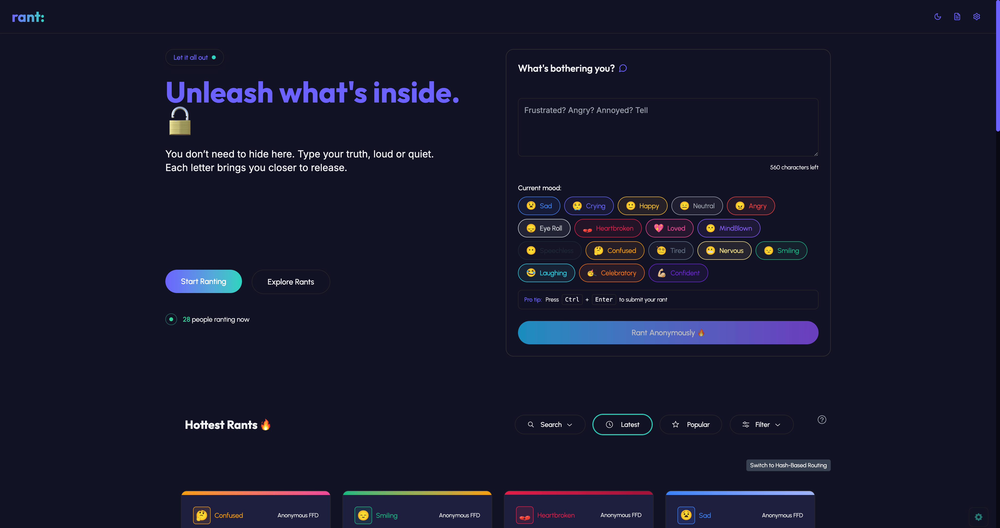

# Rant: Anonymous Space for Unfiltered Thoughts

Rant is a modern, open-source web application that provides a safe, anonymous platform for users to share their thoughts, frustrations, and celebrations with the world. Express your mood, connect with others, and explore a vibrant community—without revealing your identity.

---

## Table of Contents
- [Features](#features)
- [Screenshots](#screenshots)
- [Tech Stack](#tech-stack)
- [Project Structure](#project-structure)
- [Getting Started](#getting-started)
- [Usage](#usage)
- [Privacy & Security](#privacy--security)
- [Accessibility](#accessibility)
- [Performance & Technical](#performance--technical)
- [Contributing](#contributing)
- [License](#license)

---

## Features
- **Anonymous Posting:** Share rants without creating an account. Your identity is never revealed.
- **Mood Expression:** Tag your rants with a mood (e.g., sad, happy, angry, loved, etc.) and filter by mood.
- **Real-time Updates:** New rants and likes appear instantly via Supabase real-time subscriptions.
- **Interactive UI:** Like, bookmark, and comment on rants. Confetti and toast notifications enhance feedback.
- **Advanced Filtering:** Search and filter rants by mood, popularity, or recency.
- **Personal Rant History:** View your own rants and bookmarks (stored locally in your browser).
- **Keyboard Shortcuts:** Quickly filter, navigate, and interact using keyboard shortcuts.
- **Responsive Design:** Fully optimized for mobile, tablet, and desktop.
- **Accessibility:** High contrast mode, reduced motion, adjustable font sizes, and full keyboard navigation.
- **Theme Options:** Switch between light, dark, and system themes.

---

## Screenshots



---

## Tech Stack

**Frontend:**
- React
- TypeScript
- Tailwind CSS
- Framer Motion
- React Router
- React-Toastify

**Backend & Data:**
- Supabase (PostgreSQL, Auth, Realtime)
- Row Level Security (RLS)
- Local Storage (with optional encryption)

**Development Tools:**
- Vite
- ESLint
- Prettier

**State Management:**
- React Context
- Zustand

**Other Libraries:**
- Radix UI (accessibility primitives)
- Lucide React (icons)
- date-fns (date formatting)
- uuid (unique IDs)
- Fuse.js (fuzzy search)
- Sonner (toasts)

---

## Project Structure

```text
├── public/                # Static assets, emojis, translations
├── src/
│   ├── components/        # UI components (Navbar, RantCard, MoodSelector, etc.)
│   ├── hooks/             # Custom React hooks
│   ├── lib/               # Supabase client, data models, utilities
│   ├── pages/             # Main pages (Index, MyRantsPage, NotFound)
│   ├── store/             # Zustand stores
│   ├── styles/            # CSS and Tailwind styles
│   └── utils/             # Helper functions
├── scripts/               # Utility scripts (e.g., sitemap generation)
├── supabase/              # Supabase config
├── package.json           # Project metadata and scripts
├── vite.config.ts         # Vite configuration
└── README.md              # Project documentation
```

---

## Getting Started

### Prerequisites
- Node.js (v18+ recommended)
- npm or yarn
- Supabase account (for backend)

### Installation

1. **Clone the repository:**

   ```bash
   git clone https://github.com/ajibolagenius/rant.git
   cd rant
   ```
2. **Install dependencies:**

   ```bash
   npm install
   # or
   yarn install
   ```
3. **Configure environment variables:**
- Copy `.env.example` to `.env` and fill in your Supabase credentials:

     ```env
     VITE_SUPABASE_URL=your-supabase-url
     VITE_SUPABASE_ANON_KEY=your-supabase-anon-key
     ```
4. **Start the development server:**

   ```bash
   npm run dev
   # or
   yarn dev
   ```
5. **Open [http://localhost:8080](http://localhost:8080) in your browser.**

---

## Usage

- **Post a Rant:** Use the input form to write and submit your rant. Select a mood to tag your post.
- **Browse & Filter:** Explore rants by mood, popularity, or recency. Use the search bar and mood filters.
- **Like & Bookmark:** Interact with rants by liking or bookmarking them. Bookmarks and your own rants are stored locally.
- **Keyboard Shortcuts:** Press <kbd>Shift</kbd> + <kbd>?</kbd> to view all available shortcuts.
- **Settings:** Access theme, language, and accessibility options from the settings menu.

---

## Privacy & Security

- **Anonymous Posting:** No user accounts or personal data required. Rants are stored anonymously.
- **Row Level Security (RLS):** Supabase policies ensure that users can only access their own data.
- **Local Storage:** Bookmarks and rant history are stored in the browser's local storage, encrypted for security.
- **Data Encryption:** Sensitive data is encrypted before being stored in local storage.
- **No Tracking:** No third-party tracking or analytics. User interactions are not monitored.
- **User Control:** Users can delete their local data at any time through the settings menu.
- **Data Retention:** Rants are retained indefinitely unless deleted by the user. Supabase policies ensure data is not shared or sold.

---

## Accessibility

- **High contrast mode:** Better visibility for users with visual impairments
- **Reduced motion:** Less animation for users with motion sensitivity
- **Adjustable font sizes:** Allow users to change font sizes for better readability
- **Full keyboard navigation:** Enable users to navigate the app using only keyboard shortcuts
- **ARIA Attributes:** Screen reader support for all interactive elements

---

## Performance & Technical

- **Optimized Rendering:** React.memo implementation to prevent unnecessary re-renders
- **Efficient Data Fetching:** Optimized Supabase queries selecting only required fields
- **Error Handling:** Graceful error states and fallback UI components
- **URL Synchronization:** State reflected in URL for shareable filters and searches
- **Rate Limiting:** Prevents spam submissions and abuse

---

## Contributing

Contributions are welcome! To contribute:

1. Fork the repository
2. Create a new branch (`git checkout -b feature/your-feature`)
3. Make your changes
4. Commit and push (`git commit -m 'Add feature' && git push`)
5. Open a pull request

Please follow the code style and add tests where appropriate.

---

## License

> _No license file._

---

## Acknowledgements

- [Supabase](https://supabase.com/)
- [Shadcn UI](https://ui.shadcn.com/)
- [Radix UI](https://www.radix-ui.com/)
- [Framer Motion](https://www.framer.com/motion/)
- [Lucide Icons](https://lucide.dev/)
- [date-fns](https://date-fns.org/)
- [uuid](https://github.com/uuidjs/uuid)
- [Fuse.js](https://fusejs.io/)
- [Sonner](https://sonner.dev/)
- [Tailwind CSS](https://tailwindcss.com/)
- [Vite](https://vitejs.dev/)
- [React](https://reactjs.org/)
- [TypeScript](https://www.typescriptlang.org/)
- [Prettier](https://prettier.io/)
- [ESLint](https://eslint.org/)
- [React Router](https://reactrouter.com/)
- [React-Toastify](https://fkhadra.github.io/react-toastify/)

---

## Contact

For questions or support, open an issue or contact the maintainer.
